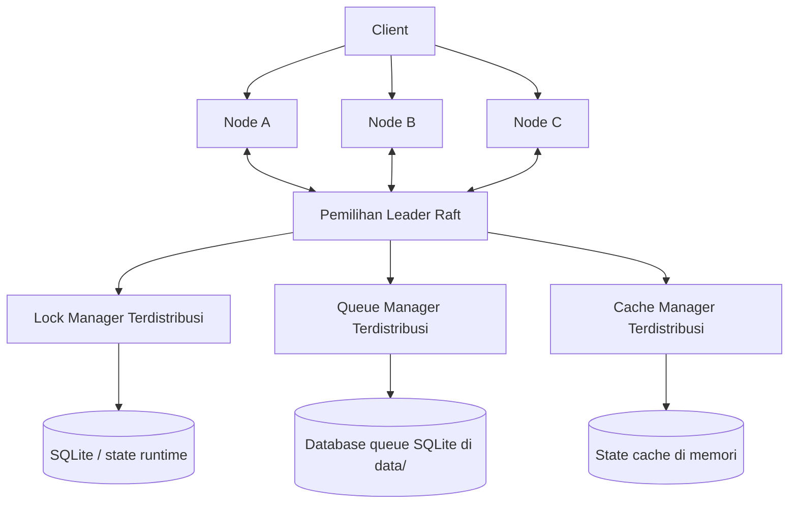

# Architecture Overview

## Components
- `src/consensus/raft.py`: mengelola pemilihan leader dan koordinasi heartbeat.
- `src/nodes/base_node.py`: menyediakan API HTTP, forwarding request, dan hook replikasi.
- `src/nodes/lock_manager.py`: tabel lock terdistribusi dengan deteksi serta resolusi deadlock.
- `src/nodes/queue_manager.py`: pemilihan owner queue berbasis consistent hashing dan persistence SQLite.
- `src/nodes/cache_manager.py`: pelacakan status cache ala MESI dengan eviction LRU.

## High-Level Diagram

## Data Flow
1. Client dapat mengirim request ke node mana pun.
2. Node follower meneruskan operasi tulis ke leader aktif.
3. Leader menerapkan perubahan secara lokal.
4. Leader mereplikasi invalidasi cache dan entri queue ke peer.
5. Follower melayani operasi baca secara lokal, atau meneruskan ke leader jika dibutuhkan.

## Runtime Notes
- File persistence queue dibuat otomatis di folder `data/` saat runtime.
- Swagger UI tersedia di `/docs`, sedangkan dokumen OpenAPI machine-readable tersedia di `/openapi.json`.

## Additional Notes
- Implementasi Raft di proyek ini berfokus pada kebutuhan praktis tugas (leader election dan koordinasi), belum mencakup seluruh kompleksitas Raft produksi.
- Untuk demonstrasi kelas, alur write-through-leader sudah cukup menunjukkan konsistensi dan koordinasi antar node.

